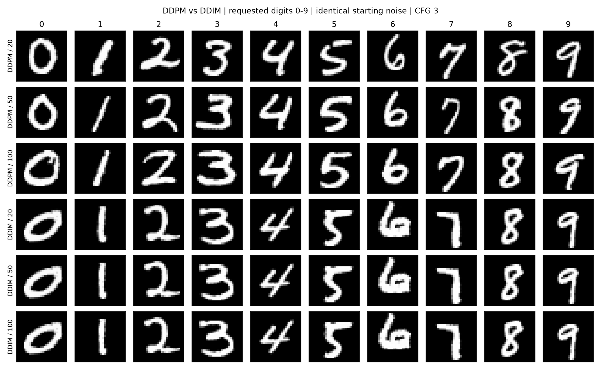
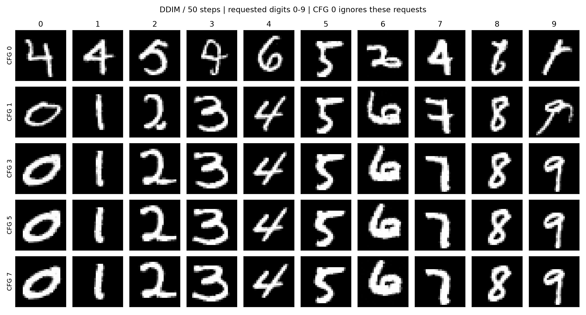
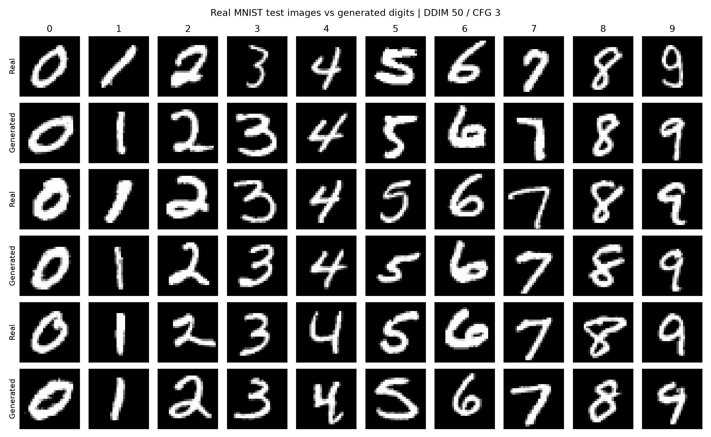

# DIFFUSION

A personal learning project on MNIST image generation: unconditional diffusion, class-conditional diffusion, DDPM/DDIM sampling, and classifier-free guidance.

The unconditional model implements its U-Net and diffusion process in PyTorch. The conditional model uses Hugging Face Diffusers for the U-Net and schedulers, with training and sampling scripts in this repository. Both generate 28 × 28 grayscale digits from Gaussian noise. Conditioning uses digit labels 0–9, not text prompts.



## Repository layout

```text
DIFFUSION/
├── Unconditional_DDPM/          # Original unconditional implementation
│   ├── diffusion_scratch.py
│   └── inference.py
├── conditional_DDMP/
│   ├── train.py
│   ├── inference.py             # DDPM sampling
│   ├── DDIM_INFERENCE.py
│   ├── classifier.py            # Train and evaluate the MNIST CNN
│   └── classifier_inference.py  # Load the CNN and evaluate saved images
├── experiments/
│   ├── experiment1.py           # DDPM vs DDIM at 20, 50, 100 steps
│   ├── experiment2.py           # CFG scales 0, 1, 3, 5, 7
│   └── experiment3.py           # Real test digits vs generated digits
├── results/
│   ├── experiment1/
│   ├── experiment2/
│   └── experiment3/
├── README.md
└── requirements.txt
```

## Setup

The published experiments were run with Python 3.13, PyTorch 2.10.0 with CUDA 12.8, and an NVIDIA RTX 2000 Ada Generation GPU (16 GB). `requirements.txt` records the package versions used. CPU execution is supported by the scripts but takes longer.

```bash
git clone https://github.com/Vansh-A1/DIFFUSION.git
cd DIFFUSION
python3.13 -m venv .venv
source .venv/bin/activate
python -m pip install -r requirements.txt
```

Use a PyTorch build appropriate for your operating system and GPU. Run the commands below from the repository root unless shown otherwise.

## Training and inference

Model weights and the MNIST dataset are not included in Git. For inference and experiments, place your existing trained weights at:

```text
conditional_DDMP/checkpoints/best.pt        # Diffusion checkpoint
conditional_DDMP/checkpoints/mnist_cnn.pth  # Classifier state dictionary
```

Alternatively, train both models using these scripts. They download MNIST to `conditional_DDMP/data/` and save weights to those locations.

```bash
python conditional_DDMP/train.py
python conditional_DDMP/classifier.py
```

The conditional diffusion defaults are 30 epochs, batch size 128, learning rate 0.0002, 1,000 training timesteps, and 10% condition dropout. The classifier uses its original 20-epoch training loop and reports validation and test accuracy. These commands train models; the three experiments only load existing weights.

Generate a digit using either sampler:

```bash
python conditional_DDMP/inference.py --digit 7 --samples 4 --cfg 3
python conditional_DDMP/DDIM_INFERENCE.py --digit 7 --steps 50 --cfg 3 --seed 42 --no-show
```

Images are saved in `conditional_DDMP/samples/`. The DDPM inference script uses the full 1,000-step schedule; experiment 1 separately compares reduced sampling schedules.

The original unconditional implementation remains available:

```bash
cd Unconditional_DDPM
python diffusion_scratch.py
python inference.py
cd ..
```

## Run the experiments

With both checkpoints available, run:

```bash
python experiments/experiment1.py
python experiments/experiment2.py
python experiments/experiment3.py
```

Experiment 3 also needs the MNIST test split in `conditional_DDMP/data/`. If you copied weights without training locally, download it once:

```bash
python -c 'from torchvision.datasets import MNIST; MNIST("conditional_DDMP/data", train=False, download=True)'
```

Each configuration generates 100 images: ten requested samples per digit. Experiments use seed 42, identical starting noise, FP32, and batches of 20. DDPM uses a separate seed (43) for reverse-process noise; DDIM uses `eta=0`. Sampling is warmed up and timed with GPU synchronization, excluding model loading, classifier evaluation, plotting, and file saving.

Results are saved under `results/experiment1/`, `results/experiment2/`, and `results/experiment3/`. Since published results already exist, another run creates a timestamped subfolder rather than replacing them. Each configuration's `.pt` file stores all generated images, requested labels, starting noise, predictions, sampler settings, and timing. PNGs show fixed examples; CSVs contain measurements for all configurations. There are 1,200 generated evaluation images across 12 configurations, plus 100 real test images. Small preflight checks and warm-ups are excluded from that count.

## Results

Published from the existing epoch-29 diffusion checkpoint and the previously trained classifier; no training was run for this evaluation. Training new weights can produce different results.

**Experiment 1 — DDPM vs DDIM, CFG 3.** Each timing covers 100 images.

| Steps | DDPM time | DDIM time | DDPM agreement | DDIM agreement |
|---|---:|---:|---:|---:|
| 20 | 4.04 s | 4.21 s | 100% | 100% |
| 50 | 10.29 s | 10.68 s | 100% | 100% |
| 100 | 21.03 s | 22.07 s | 100% | 100% |

DDIM was slightly slower at equal step counts in this run. These results do not establish a general speed or image-quality advantage for either sampler.

[Sampling times](results/experiment1/sampling_time.png) · [Accuracy vs steps](results/experiment1/accuracy_vs_steps.png) · [CSV](results/experiment1/results.csv)

**Experiment 2 — guidance strength, DDIM with 50 steps.**

| CFG | Requested-digit agreement | Seconds / 100 images |
|---|---:|---:|
| 0 | 7% | 5.58 s |
| 1 | 99% | 5.60 s |
| 3 | 100% | 11.16 s |
| 5 | 100% | 11.17 s |
| 7 | 100% | 11.15 s |

CFG 0 is unconditional, so its low agreement with arbitrary requested digits is expected. CFG 0 and 1 need one model prediction per step; the higher scales here need two, explaining much of the timing difference.

**Experiment 3 — real versus generated, DDIM with 50 steps and CFG 3.**

| Image group | Images | Classifier result |
|---|---:|---:|
| Real MNIST test subset | 100 | 100/100 correct true labels |
| Generated digits | 100 | 100/100 match requested labels |

### How classifier-free guidance is used

```text
prediction = unconditional + cfg * (conditional - unconditional)
```

The null class is label 10. CFG 0 uses only this null label; CFG 1 uses the requested digit directly. Higher scales use both predictions. Experiment 2 verifies that changing requested labels leaves CFG-0 samples unchanged when starting noise is fixed. The classifier measures agreement with requested labels; it does not guide sampling.



[Guidance accuracy plot](results/experiment2/accuracy_vs_cfg.png) · [Guidance measurements](results/experiment2/results.csv)



[Real/generated measurements](results/experiment3/results.csv)

## Evaluate saved images

Use the trained classifier on any generated configuration file:

```bash
python conditional_DDMP/classifier_inference.py --images results/experiment1/ddim_50.pt
```

The command reads the saved images and labels and reports requested-digit agreement and mean classifier confidence. Experiment images are in `[0, 1]`; the classifier normalizes them using MNIST mean `0.1307` and standard deviation `0.3081`. Its Python API also accepts `[-1, 1]` inputs by specifying `image_range="minus_one_one"`.

## What these results show

The inspected grids contain recognizable handwritten digits with different stroke shapes and widths. Some strokes are uneven. The classifier results support successful digit conditioning on these samples.

These are small, fixed-seed experiments with one timing measurement per configuration. Classifier agreement is not a realism or diversity metric, and 100% agreement does not establish generalization or rule out memorization. The real-image score covers a balanced 100-image subset of the MNIST test split, not the full test set. No FID, independent diversity score, or memorization analysis is reported. Timings apply to the hardware and batch size above.

## Project authorship

I developed the core diffusion training and inference pipelines, including class-conditional image generation and DDPM/DDIM sampling workflows, as a learning and research exercise in diffusion-based generative modeling.

OpenAI Codex was used as a development assistant for experiment and evaluation utilities, verification checks, documentation, and repository organization. The conditional implementation builds on PyTorch, Torchvision, and Hugging Face Diffusers.
